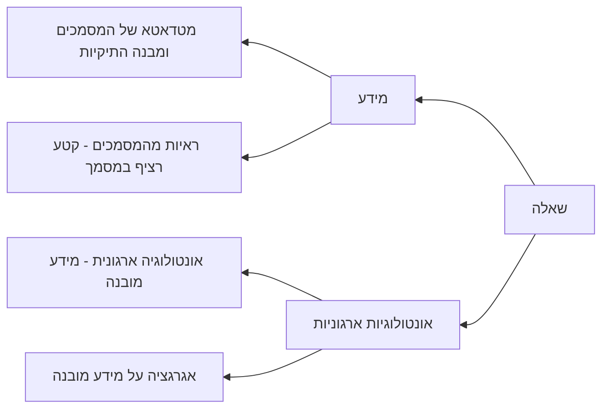

# הקדמה
המוטיבציה הוא qa ארגוני על מידע מטויב ושאלות ניתנות למענה[^מידע-מטויב-ושאלות-ניתנות-למענה].
- הטענה המרכזית היא שיש כיום חוסר שיטתיות במיפוי מספק ל**מקורות הקרקוע** הנדרשים לצורך המענה. **מקורות הקרקוע** הן רכיב מרכזי שלעיתים מתייחסים אליו כאילו מובן מאליו שהם ה"צ'אנקים מהמסמכים" אך לפעמים הן לא מקורות הקרקוע הנדרשים, ובוודאי לא באופן בלבדי.
- טענה מרכזית נוספת היא שחוסר מיפוי זה יוצר לבנצ'מארקים המפורסמים הטייה למחלקה של "מספר ראיות חסום מהמסמכים", לרוב התיוג הוא "המסמכים". 
- טענה פחות מרכזית (כי יותר קשה להוכחה) היא שיש לזה קשר לפער המוכנות לפרודקשיין במערכות QA ארגוניות כי הקרקוע הנדרש לשאלות הארגוניות מתפלג אחרת במחלקות הקרקוע.
# הנחות היסוד של סביבת העבודה
מערכת QA עם מידע מטויב במאגר המידע. השאלות הם שאלות שיש להם תשובה והיא יחידה.
# התרומה המרכזית
הסדר והשיטתיות במערכות QA לשלבי מיפוי המידע הנדרש לצורך המענה.
במאגר מידע המורכב ממסמכים, השאלות מתחלקות ל2 סוגים: שאלות על המידע (המסמכים), ושאלות על המבנים (האונטולוגיות הארגוניות) שנגזרים מהמסמכים וחבויים בהם.

[^מידע-מטויב-ושאלות-ניתנות-למענה]: כלומר, שאלה תשובה בלבד, כאשר אין דו משמעות בשאלה וניתן לענות על פי הנתונים באופן יחיד.
# הטענות שנרצה להוכיח
1. (כיסוי) כלל הבנצמארקים המרכזיים (כאשר נבחן את המרכזיים כאן), השאלות שלהם מתחלקות ע"פ המחלקות האלה.
2. (אבחון) בנצ'מארקים שונים בוחנים דברים שונים על אף שכולם נקראים QA או ראג, והם מוטים דרמטית לראיות.
3. (כשל מותנה מחלקה) ראג קלאסי עובד משמעותית טוב יותר על מחלקות מקומיות מאשר במחלקות האחרות.
4. (שימושיות) אבחנה וזיהוי סוג רכיב הקרקוע והתאמה לשיטה הרלוונטית מאפשרת שיפור.
5. (לא טענה - דוגמאות עולם אמיתי - אופציונלי) התפלגויות פרודקשיין אל מול צפי בPOC של סוגי השאלות, אולי דוגמא אולי כמה.
# הטענות
## טענה 1 - כיסוי
כיסוי מעשי (Operational coverage) - השאלות מתחלקות למחלקות האלה לצורך קרקוע המענה בבנצ'מארקים המרכזיים מבוססי המסמכים, כלומר רוב ניכר של השאלות בבנצ'מארקים שייך לאחת או יותר ממחלקות הקרקוע האלה ורק להן (שוב - ברוב ניכר נניח 85-95 אחוז).
מה יש לעשות:
1. לאפיין שיטה וכללים (כלומר חתימות למחלקות) כיצד לסווג (יחיד\מרובה) למחלקות הקרקוע. ליישם שיטה.
2. לייצר מנגנון שיוך למחלקות. לשקול מעורבות אנושית ומינונים. לחשוב על פערים במצב בו יש את התשובה והראיות הנוספות מראש, לבין זמן אמת בו יש רק את השאלה - כלומר חלק מרכזי במחקר יהיה בכלל כאן - אופן השיוך ועל בסיס מה.
3. לאסוף את הבנצמארקים המרכזיים ולהחליט עליהם, שעליהם מבצעים את הניסוי -  **למצוא לפחות בנצ'מארק מרכזי אחד בעל אופי ארגוני שבו הצפי למחלקות הפחות שכיחות**.
4. ביצוע הניסוי והשיוך ואימות אנושי.
5. תחקור פערים במידת הצורך, ודיוק המחלקות והתהליך.
### דרך הפתרון בקרוב
כתיבת שיטה שבה נמיין את הסוגים - הכיוון הוא כזה כרגע: שימוש בשאלה, בתשובה, ובמידע הנוסף שהבנצמארק מביא איתו (לדוגמא - מסמכי המקור) בפרומפט ובקשה ממודל שפה להגיד מהם השלבים שנדרשים לצורך המענה. ממש כיצד אדם שהיה צריך לענות - מהם השלבים שהוא היה צריך לעשות לצורך המענה. קשיים - מה עם פילטור ע"פ מטאדטא שנמצא במסמכים האחרים? הרי לא נקבל אותם, או שימוש אונטולוגי - לא ברור שנצליח ככה לזקק את זה ובוודאי שלא סיכומי.
נתחיל ככה בבנצ'מארק אחד ונראה איך מתקדם שיטת התיוג הזו. קשה מאוד להאמין שככה נגיע לשאלות אגרגטיביות ומבוססות אונטולוגיות חבויות במידע.
**במקביל יש לרכז את כל הבנצמארקים, מבוססי המסמכים, והשאלות-תשובות הניתנות למענה. לקוות להגיע לאחד חשוב שיותר ארגוני בשאיפה להגיע לריבוי שאלות שהם מהקטגוריות האונטולוגיות-אגרגטיביות (עשרות אחוזים בודדים יספיקו בדטאסט בגודל לא קטן).** **נראה שצריך לקבוע קריטריונים ברורים מיהם הדטאסטים שנרצה להכניס ולהכניס את מי שעונה על הקריטריונים.** נראה שכרגע נתמקד בריבוי בחירה של המחלקות הרלוונטיות לכל שאלה, כלומר ריבוי בחירה באופן שטוח ולא עצי לכרגע.
## טענה 2 - אבחון
1. אחרי שהשלב הקודם הסתיים וקיבלנו החלטה על סיום, הרצה מלאה של כלל הבנצמארקים.
2. ניתוח תוצאות וויזואליזציות. הדגשה והתייחסות למבוססי ראיות. אם יש בשלב זה כבר מידע ארגוני להריץ עליו (מהצבא) אז להריץ גם עליו.
3. הוספת בנצ'מארקים במידת הצורך ויצירת טבלאות מסכמות, ואולי ניסיון להסביר התפלגויות לכל בנצ'מארק.
## טענה 3 - כשל מותנה מחלקה
1. הרצת סדרת שיטות קלאסיות של ראג כביסליין.
2. השוואה ההצלחה של השיטות ע"פ מחלקה - מסקנות ההשערה.
## טענה 4 - שימושיות, שיטה
שימוש בrouting נאיבי כבייסליין לשיפור. כשנגיע לשם נחשוב על שיטות יותר מתקדמות משאר Routing נאיבי.
אני חושב שגם הנאיבי ישפר את המחלקות האחרות בצורה משמעותית שתספק - אבל כדי לייצר משהו שנראה יותר טוב כדאי שנפתח שיטות נוספות.
## טענה נוספת או חלק מ2 - פער POC לעולם אמיתי
אברר כבר מהיום אם ומאיפה אני יכול להוציא מידע כזה בצבא, איזה אישורים נדרשים.
התפלגות המחלקות ותיאור על אופי המידע אמור לדעתי להספיק ואם בדוגמאות המתאימות שאמצא ואצליח להביא יהיה מה שנשער זה יכול להיות משמעותי מאוד למאמר.
בכל מקרה ההוספה של זה יכולה להיות בסוף אחרי שהכל כבר מוכן - לצורך המאמר, זה בלתי תלוי.

# התייחסויות נוספת
## יצוגים נגזרים
ישנו דבר נוסף "שחסר" לצורך קרקוע מלא למענה התשובה והוא הייצוגים הנגזרים והחישוב עליהם.
בתחילה חשבתי לשים את זה כמחלקה נוספת, אבל כבר אז היא הרגישה לי יותר כמו ציר אורתוגונלי, ומחקר נוסף עזר לי לחדד לעצמי את המושג המרכזי שנרצה לשים במחקר והוא 'סוגי מקורות הקרקוע הנדרש למענה'. בהתחלה חשבתי להתמקד במושג רחב יותר שהוא 'המינימום הנדרש למענה על שאלה', אבל "המחלקה החמישית" מביאה איתה 2 דברים נוספים - ייצוג הערכים (מיקום, זמן, דרגות בצבא), והחישוב ביניהם. זה ציר נוסף שכדאי לציין אותו במאמר אבל להדגיש שהוא בחוץ, והמושג המרכזי במחקר יהיה מקורות הקרקוע.
## מאמר STARK על מידע חצי מובנה
בחיפושי אחר דטאסט מתאים, הגעתי למאמר שיצא בACL האחרון מסטנפורד עם אמאזון שטען שעל מידע חצי מובנה כדאי לייצר את החלוקה בין מענה על המידע למענה על מבנים והראה שיפור בבנצ'מארקים רלוונטיים. לא העמקתי עדיין אבל זה לחלוטין לא במסגרת של רכיבי הגראונדינג אלא תחום למידע שהוא מראש חצי מובנה. כדאי שנראה מה יש לקחת משם ואיך לייצר מספיק בידול
   https://arxiv.org/pdf/2404.13207v1 

