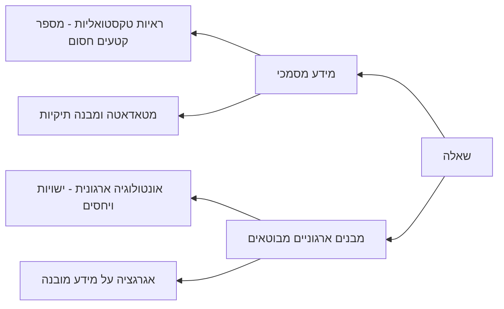

# תוכנית מחקר
## תקציר
המוטיבציה היא QA ארגוני על מידע מטויב ושאלות ניתנות למענה[^מידע-מטויב-ושאלות-ניתנות-למענה].

הטענה המרכזית היא שבמערכות QA ארגוניות מבוססות מסמכים, **מקור הקרקוע הנדרש למענה אינו תמיד מספר קטעי טקסט חסום וסביר מתוך המסמכים**. לעיתים נדרשת ראיה טקסטואלית מקומית, אך לעיתים נדרש שימוש בערכי מטאדאטה, במבנה תיקיות, בישות או יחס אונטולוגי ארגוני, או באגרגציה על מידע מובנה שמבוטא במסמכים.

חוסר השיטתיות במיפוי **מקורות הקרקוע** גורם לכך שבנצ'מארקים ושיטות RAG רבות מתייחסות בפועל לתת-בעיה צרה יחסית: מציאת מספר קטעים חסום וסביר מתוך מסמכים. כאשר מדווחים רק ציון כולל אחד לכל שיטה או לכל בנצ'מארק, קשה לראות אם השיטה מצליחה בעיקר בשאלות ראייתיות אך נכשלת בשאלות שדורשות מטאדאטה, מבנה, אונטולוגיה או אגרגציה.

טענה רחבה יותר, שתישמר כאפשרות הרחבה ולא כעמוד תווך, היא שהתפלגות סוגי הקרקוע ב-POC ובפרודקשיין ארגוני עשויה להיות שונה מההתפלגות בבנצ'מארקים פומביים. אם ניתן יהיה להשיג אישורים ודוגמאות מהארגון, זה יכול לשמש כוולידציה חיצונית חזקה.

[^מידע-מטויב-ושאלות-ניתנות-למענה]: כלומר, שאלות שיש להן תשובה יחידה על בסיס הנתונים. אין דו-משמעות מהותית בניסוח השאלה, ואין כפילות או סתירה בנתונים שמובילה לכמה תשובות אפשריות לאותה שאלה.

## הנחות יסוד ותיחום
- סביבת העבודה היא מערכת QA מעל מאגר מידע מטויב: המידע הרלוונטי קיים, אינו סותר את עצמו ביחס לשאלה, ואפשר להכריע ממנו תשובה אחת.
- השאלות הן שאלות ניתנות למענה, עם תשובה יחידה ומוגדרת. כלומר, המחקר אינו עוסק בשאלות עמומות, בשאלות עם כמה תשובות נכונות, או במקרים שבהם בסיס הנתונים עצמו מכיל גרסאות סותרות ללא הכרעה.
- יחידת הניתוח המרכזית היא שאלה-תשובה, יחד עם מקורות המידע שהבנצ'מארק מספק לצורך מענה.
- המחקר מתמקד ב**סוג מקור הקרקוע הנדרש למענה**, ולא בכל המינימום החישובי או הייצוגי הדרוש לפתרון מלא של השאלה.
- בשלב הראשון, תיוג השאלות יתבצע כריבוי בחירה שטוח: שאלה יכולה להשתייך למחלקה אחת או יותר.

# התרומה המרכזית
התרומה המרכזית היא מסגרת אופרטיבית לסיווג שאלות QA לפי **מקורות הקרקוע הנדרשים למענה**.

במאגר מידע שמורכב ממסמכים, שאלות אינן נשענות רק על "המסמכים" כמקור אחיד. הן עשויות לדרוש לפחות שני סוגים רחבים של קרקוע:

1. **קרקוע במידע המסמכי עצמו**: ראיות טקסטואליות, מטאדאטה, ומבנה תיקיות.
2. **קרקוע במבנים ארגוניים שמבוטאים במסמכים**: אונטולוגיות ארגוניות, ישויות, יחסים, ואגרגציות על מידע מובנה. המבנים האלה אינם בהכרח "נגזרים" מהמסמכים במובן המושגי; לעיתים הם קיימים בארגון, והמסמכים הם המקום שבו הם מתועדים, משתנים או מקבלים ביטוי.

החידוש אינו רק בשם המחלקות, אלא בהפיכתן לאמצעי ניתוח: ניתן לתייג שאלות, לנתח את התפלגותן בבנצ'מארקים, לבדוק כיצד שיטות RAG נכשלות לפי מחלקה, ולבחון האם הבנת מחלקות הקרקוע יכולה להכווין פתרונות מורכבים יותר, שבהם זיהוי סוג השאלה והשיטה המתאימה מתעצבים יחד.

## מחלקות מקורות הקרקוע

המחלקות הראשוניות:

1. **ראיות טקסטואליות מקומיות**: מענה שניתן לקרקע באמצעות סדרת חיפושים ממוקדת שמובילה למספר קטעים חסום וסביר מתוך המסמכים. חסום וסביר אינו בהכרח מספר קטן מאוד; הקריטריון הוא שאופן הפתרון הטבעי דומה לחיפוש חוזר וממוקד שאדם היה מבצע, ולא לסריקה רוחבית, סיכום או חישוב על כלל המאגר. לכן גם שאלה מורכבת או multi-hop יכולה להשתייך למחלקה הזו אם דרך הפתרון שלה נשארת מקומית וממוקדת.
2. **מטאדאטה ומבנה תיקיות**: מענה שדורש שימוש בערכי מטאדאטה כגון מקור, תאריך, בעלות, גרסה, היררכיית תיקיות, שיוך מסמך או מאפיין אחר שאינו חלק מתוכן הראיה עצמו. גם מטאדאטה שמופיע בתוך המסמך, למשל בכותרת, טבלת מאפיינים או שדה גרסה, עדיין ייחשב מטאדאטה אם תפקידו לתאר את המסמך, הישות, ההקשר או הגרסה, ולא לשמש כראיה תוכנית רגילה.
3. **אונטולוגיה ארגונית**: מענה שהאובייקט המרכזי בו הוא ישות ארגונית, יחס בין ישויות, תפקיד, מוצר, תהליך, גרסה או מבנה ארגוני שיש להם קיום ומשמעות בארגון מעבר למסמך יחיד. המסמכים מבטאים את הישויות ואת מחזור החיים שלהן, אך הדרך הטבעית לענות על השאלה אינה רק ניווט בין קטעי טקסט, אלא זיהוי הישות והיחסים הרלוונטיים שלה לאורך המסמכים.
4. **אגרגציה על מידע מובנה**: מענה שדורש ספירה, השוואה, סינון, קיבוץ או פעולה דומה על ייצוג מובנה שמבוטא במסמכים או ניתן לחילוץ מהם.

שאלה יכולה להשתייך ליותר ממחלקה אחת. כאשר פתרון מלא דורש כמה סוגי מקורות קרקוע, התיוג צריך לשקף את כל המחלקות הרלוונטיות.

# הטענות שנרצה להוכיח
1. **כיסוי**: בבנצ'מארקים מרכזיים של QA/RAG מבוססי מסמכים, רוב ניכר של השאלות ניתן לסיווג לפי מחלקות מקורות הקרקוע האלה.
2. **אבחון**: בנצ'מארקים שונים בוחנים דברים שונים על אף שכולם מוצגים כ-QA או RAG, ובפועל קיימת הטיה משמעותית לשאלות מבוססות ראיות טקסטואליות.
3. **כשל מותנה מחלקה**: שיטות RAG קלאסיות מצליחות משמעותית יותר במחלקות שמבוססות על ראיות מקומיות, ונכשלות יותר במחלקות שדורשות מטאדאטה, מבנה, אונטולוגיה או אגרגציה.
4. **שימושיות**: זיהוי מחלקת הקרקוע יכול להכווין שימוש מושכל יותר בשיטות קיימות או בפיתוח שיטות ייעודיות, כך שסוג השאלה, מקור הקרקוע ושיטת המענה יתאימו זה לזה טוב יותר מאשר ב-RAG אחיד.
5. **וולידציה ארגונית אופציונלית**: אם ניתן יהיה לקבל אישורים ודוגמאות מהארגון, אפשר להשוות בין התפלגות סוגי השאלות ב-POC או בפרודקשיין לבין ההתפלגות בבנצ'מארקים פומביים. טענה זו תישמר לסוף, ולא תהיה תלויה בהצלחת שאר המחקר.

# תוכנית לפי טענות
## טענה 1 - כיסוי
**כיסוי מעשי (Operational coverage)**: רוב ניכר של השאלות בבנצ'מארקים מרכזיים מבוססי מסמכים שייך לאחת או יותר ממחלקות הקרקוע המוצעות, ורק אליהן. יעד ראשוני סביר: 85-95 אחוזי כיסוי, בכפוף לבדיקה אמפירית.

תוכנית העבודה לטענה זו מפורקת תחת [[hypotheses/hypothesis-1/01-claim-and-scope|Hypothesis 1 - Claim and Scope]], [[hypotheses/hypothesis-1/02-labeling-classes|Hypothesis 1 - Labeling Classes]], ו-[[hypotheses/hypothesis-1/03-technical-plan|Hypothesis 1 - Technical Plan]]. סקירות הדאטסטים שנמצאות תחת `hypotheses/datasets/deep_research` הן חומרי גלם לא מחייבים, ולא מסמך תכנון רשמי.

השלב הראשון אינו תיוג מלא, אלא בדיקת ישימות דרך הדאטסטים עצמם: צריך לאתר 6-8 דאטסטים רלוונטיים, ומתוכם 1-2 שבהם יש סיכוי ממשי ששאלות אונטולוגיה ארגונית ואגרגציה יחד יגיעו ל-30-40 אחוז במדגם פיילוט. אם לא נמצאים דאטסטים כאלה, זה לא רק עיכוב טכני אלא ממצא על הפער בין בנצ'מארקים פומביים לבין QA ארגוני.

לאחר שער הישימות, יש להפוך את מחלקות הקרקוע לפרוטוקול תיוג אופרטיבי שמבוסס על תוכנית פעולה: מה אדם היה צריך לעשות כדי להגיע לתשובה, אילו מקורות קרקוע נדרשו בכל צעד, ואילו תוויות נובעות מהצעדים. התוצרים המרכזיים הם registry של דאטסטים, סכימת תיוג, הנחיות תיוג, נרמול רשומות שאלה, פיילוט ידני, סוכן תיוג שמייצר trace, בדיקת agreement, ואימות אנושי מדגמי.

## טענה 2 - אבחון
לאחר קיבוע ראשוני של המחלקות ותהליך התיוג, יש להריץ תיוג מלא על כלל הבנצ'מארקים שנבחרו.

תוצרים רצויים:

1. טבלת התפלגות מחלקות לכל בנצ'מארק.
2. ויזואליזציה שמראה עד כמה כל בנצ'מארק מוטה לראיות טקסטואליות לעומת מחלקות אחרות.
3. ניתוח איכותני של דוגמאות מייצגות לכל מחלקה.
4. במידת הצורך, הוספת בנצ'מארקים כדי לוודא שיש ייצוג מספק למחלקות הפחות שכיחות.

הטענה החשובה כאן היא לא רק שיש הטיה, אלא שמדדי הערכה כוללים מסתירים את ההבדלים בין סוגי שאלות שונים.

## טענה 3 - כשל מותנה מחלקה
יש להריץ סדרת שיטות RAG קלאסיות כבייסליין, ולנתח ביצועים לפי מחלקת הקרקוע ולא רק לפי ציון ממוצע.

מה יש לבדוק:

1. האם RAG קלאסי עובד טוב יותר על שאלות שמבוססות על ראיות טקסטואליות מקומיות.
2. האם יש ירידה עקבית בשאלות שדורשות מטאדאטה, אונטולוגיה או אגרגציה.
3. האם דירוג השיטות משתנה כאשר מנתחים כל מחלקה בנפרד.

אם התוצאה תראה שהממוצע הכללי מסתיר כשלים עקביים במחלקות מסוימות, זו תהיה תרומה חזקה גם ללא דוגמה ארגונית.

## טענה 4 - שימושיות ושיטה
הבייסליין השימושי הראשון יכול להיות routing נאיבי לפי מחלקת הקרקוע, אך זו רק דוגמה ראשונית. המטרה הרחבה יותר היא להראות שהבנת מחלקות הקרקוע יכולה להשפיע על תכנון פתרונות: לבחור שיטות קיימות באופן מדויק יותר, לשלב ביניהן, או לפתח שיטות שבהן זיהוי סוג השאלה ואופן המענה מתעצבים יחד.

כיוונים אפשריים:

1. שאלות ראייתיות יופנו ל-RAG קלאסי.
2. שאלות מטאדאטה יופנו למנגנון שמחפש גם בשדות מטאדאטה ומבנה תיקיות.
3. שאלות אונטולוגיות יופנו לייצוג ישויות ויחסים, אם קיים או אם ניתן לגזור אותו.
4. שאלות אגרגטיביות יופנו לייצוג מובנה או לשלב ביניים שמחלץ טבלה/מבנה לפני המענה.

ייתכן שגם routing נאיבי יספיק כדי להראות שיפור במחלקות שאינן ראיות טקסטואליות. אם הזמן יאפשר, ניתן לפתח שיטות מתקדמות יותר, אך הן לא צריכות להחליף את הניסוי הבסיסי.

## טענה 5 - וולידציה ארגונית אופציונלית
טענה זו תישמר לסוף, ותיכנס רק אם ניתן יהיה לקבל אישורים ודוגמאות מהארגון.

המטרה האפשרית:

1. למדוד או לאפיין התפלגות סוגי שאלות ב-POC או בפרודקשיין ארגוני.
2. להשוות אותה להתפלגות בבנצ'מארקים הפומביים.
3. להראות האם בנצ'מארקים פומביים אכן מייצגים באופן חסר את סוגי הקרקוע שחשובים בארגון.

גם אם לא ניתן יהיה להביא את הדוגמאות עצמן, ייתכן שתיאור התפלגותי או אנונימי יספיק כוולידציה חיצונית. בכל מקרה, המחקר המרכזי לא יהיה תלוי בכך.

# התייחסויות נוספות
## ייצוגים נגזרים
יש רכיב נוסף שקשור למענה מלא: ייצוגים נגזרים והחישוב עליהם. בתחילה אפשר היה לחשוב עליו כמחלקת קרקוע נוספת, אך כרגע עדיף לראות בו ציר אורתוגונלי.

הסיבה היא שהמחקר המרכזי עוסק ב**סוג מקור הקרקוע הנדרש למענה**, בעוד שייצוגים נגזרים מערבים שתי שאלות נוספות:

1. איך מייצגים ערכים כגון זמן, מיקום, דרגות, יחידות או היררכיות.
2. איזה חישוב נדרש לבצע על הערכים האלה.

ההתייחסות לציר הזה חשובה למחקר משום שהיא מגדירה במדויק את גבול התרומה: מענה מלא לשאלה עשוי לדרוש גם ייצוג וחישוב, אבל המחקר הנוכחי מתמקד בשלב מוקדם יותר - זיהוי מקורות הקרקוע הנדרשים וסיווגם. כך אפשר לבחון באופן נקי יותר מהו המידע שצריך להשיג לפני שעוסקים באופן שבו מייצגים אותו או מחשבים עליו.

## מאמר STARK על מידע חצי מובנה
STaRK הוא מאמר רלוונטי כעבודה קרובה, משום שהוא עושה צעד חשוב בהבחנה בין מידע על הטקסט או המידע הגולמי, לבין מידע על ישויות, יחסים ואונטולוגיות. במובן הזה הוא קרוב מאוד לשאלה שמעניינת אותנו: האם השאלה נענית מתוך המסמך כטקסט, או מתוך מבנה ישויות ויחסים שהטקסט מבטא.

הבידול המרכזי הוא ש-STaRK בנוי מראש מעל בסיסי ידע חצי-מובנים, שבהם האובייקטים, הישויות והיחסים כבר קיימים כחלק מהייצוג. אצלנו נקודת המוצא שונה: המידע הוא מסמכי, והאונטולוגיה הארגונית אינה נתונה מראש אלא חבויה או מבוטאת במסמכים. לכן השאלה המחקרית אינה רק איך לאחזר מעל טקסט ויחסים קיימים, אלא איך לזהות מתי שאלת QA מבוססת מסמכים בעצם דורשת קרקוע בישות, יחס או מבנה ארגוני שלא סופקו במפורש.

חשוב לחדד את הבידול הזה במאמר כדי להימנע מביקורת שהעבודה רק חוזרת על ההבחנה של STaRK. התרומה כאן היא מסגרת לניתוח שאלות QA/RAG מבוססות מסמכים לפי מקור הקרקוע הנדרש, גם כאשר המקור האונטולוגי אינו חלק מפורש מהדאטה.

קישור:
https://arxiv.org/pdf/2404.13207v1
