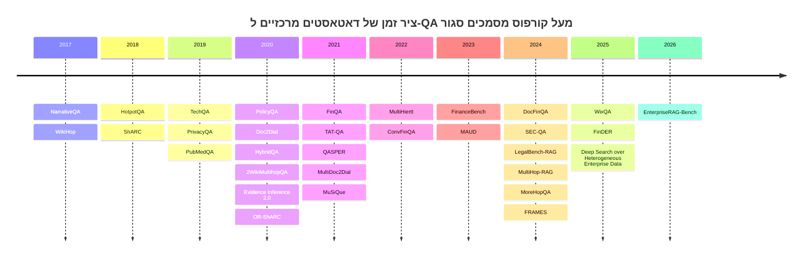

# רג׳יסטר דאטאסטים ל־QA מעל קורפוס מסמכים סגור עבור תזת RAG ארגונית

## תקציר מנהלים

לפי מסמכי התזה שהעלית, נקודת המיקוד איננה “עוד פתרון RAG”, אלא מיפוי שיטתי של **מקורות הקרקוע הנדרשים** בדרך לתשובה, ובפרט ההבחנה בין ראיות טקסטואליות, מטא־דאטה/זמן, אונטולוגיה ארגונית, ואגרגציה על ישויות; בנוסף, פתיחת המחקר אמורה להיות בדיקת **ישימות דרך הדאטאסטים** לפני השקעה עמוקה בשיטה. 

המסקנה המרכזית של הסקירה היא שיש כיום **כמה מועמדים טובים מאוד** לבניית רג׳יסטר ראשוני, אבל אין דאטאסט ציבורי יחיד שמכסה באופן טבעי את כל מה שאתה מחפש בעולם QA ארגוני. לכן, הדרך הנכונה היא לא “לחפש את הדאטאסט המושלם”, אלא לבנות **סט ליבה הטרוגני**:  
מצד אחד דאטאסטים **ארגוניים־למחצה/תמיכתיים** כמו **EnterpriseRAG-Bench**, **WixQA**, ו־**TechQA**; מצד שני דאטאסטים **מסמכיים־אנליטיים** כמו **FinQA**, **DocFinQA**, **FinanceBench**, **TAT-QA**, ו־**MultiHiertt**; ולצדם דאטאסטי **בקרה** שמודדים multi-hop/metadata/temporal כמו **FRAMES** ו־**MultiHop-RAG**. שילוב כזה משרת היטב את ההשערה שלך על ניווט במסמכים, ניווט בישויות חבויות, שימוש במטא־דאטה, ולבסוף אגרגציה. 

אם המטרה המעשית היא לבחור עכשיו **6–8 דאטאסטי ליבה**, הבחירה הטובה ביותר בעיניי היא: **EnterpriseRAG-Bench, WixQA, TechQA, FinQA, MultiHiertt, FinanceBench, LegalBench-RAG, QASPER**, עם **FRAMES** ו־**MultiHop-RAG** כדאטאסטי בקרה ולא כדאטאסטי ליבה “ארגוניים”. הסיבה: הסט הזה מכסה טוב את ארבע מחלקות הקרקוע שלך, וגם כולל שני מועמדים סבירים במיוחד לכך שמחלקות **Dept3–4** יהיו משמעותיות — **EnterpriseRAG-Bench** בוודאות גבוהה, ו־**TechQA** או **WixQA** כהימור טוב שני; בדאטאסטים הפיננסיים תקבל בעיקר **Dept4** חזק מאוד, ופחות **Dept3**. זהו ניתוח אנליטי שלי על בסיס מבנה הדאטאסטים, לא תיוג רשמי שהמחברים מספקים. 

עוד מסקנה חשובה: הסיבה ש־FRAMES נראה לך נכון אינטואיטיבית הייתה טובה. FRAMES **לא** מתאים להיות עוגן “enterprise-like”, אבל הוא **כן** צריך להיות ברג׳יסטר כ־**control / multihop benchmark**: הוא נותן multi-hop אמיתי, reasoning labels, temporal reasoning, multiple constraints, וטווח רחב של מספר מסמכים נדרשים; בדיוק בגלל זה הוא טוב כקבוצת ביקורת שבודקת את השלב האלגוריתמי אחרי שהרג׳יסטר שלך כבר מסווג את מקורות הקרקוע.

## מסגרת ההערכה ומה FRAMES כן אומר על הסקירה

כדי ליישר קו עם התזה, השתמשתי בארבע מחלקות העבודה הבאות, שהן למעשה הפרשנות המחקרית של מה שכתבת:  **Dept1 — ראיות טקסטואליות**, **Dept2 — מטא־דאטה/זמן**, **Dept3 — אונטולוגיה ארגונית**, **Dept4 — אגרגציה**. אצלך, המטרה היא לא רק “האם יש תשובה”, אלא “מה אדם היה צריך לעשות כדי להגיע לתשובה, ומהו סוג הקרקוע של כל צעד”. זו בדיוק הסיבה שדאטאסטים עם gold evidence, doc IDs, programs, metadata, tables או snippet ranges חשובים יותר מדאטאסטים עם answer בלבד. 

לכן, הקריטריון המכריע איננו “כמה הדאטאסט מפורסם”, אלא עד כמה הוא מאפשר לשחזר **תוכנית פעולה אנושית**:  
האם יש מסמך מקור ידוע, האם יש ראיה ברמת passage/span/snippet, האם יש מטא־דאטה מסמכי, האם מופיעים ישויות/פרויקטים/מוצרים/תפקידים שחוזרים בקורפוס, והאם יש שאלות שדורשות אגרגציה או סינתזה על פני יותר ממסמך אחד. זה גם מסביר למה, בדיעבד, סקירה שהסתכלה רק על “enterprise-like” במובן האינטואיטיבי שלה הייתה צרה מדי.
### למה רוב הדאטאסטים מטבלת ההשוואה של FRAMES לא אמורים כולם להיכנס באותה רמה
הנקודה החשובה היא שטבלת ההשוואה של FRAMES מערבבת **שני דברים שונים**:  
מצד אחד, “מבחני יכולת כלליים” ל־factuality/reasoning/retrieval; מצד שני, “QA מעל corpus סגור של מסמכים”. לכן, חלק מן הדאטאסטים שם אכן היו צריכים להיכנס לסקירה ההיסטורית שלך, אבל **לא כולם**, ולא כולם באותה קטגוריה. FRAMES עצמו מציג במפורש שלצד דאטאסטים מסמכיים/רטריבאליים כמו **MultiHop-RAG**, **MoreHopQA**, **MuSiQue**, **Natural Questions**, **TriviaQA** ו־**HotpotQA**, הוא משווה גם מול **TruthfulQA**, **GSM8K** ו־**ELI5**, שהם אינם “QA מעל קורפוס מסמכים סגור” במובן שאתה צריך לרג׳יסטר. 

כלומר, בסקירה הנכונה לתזה שלך:  
**כן** — צריך להכניס כקבוצת בקרה/היסטוריה את **FRAMES**, **MultiHop-RAG**, **MoreHopQA**, **MuSiQue**, **2WikiMultihopQA**, **HotpotQA**, ובמובן מסוים גם **Natural Questions/TriviaQA** כגבול retrieval.  
**לא** — לא צריך להכניס ליבה כמו **TruthfulQA**, **GSM8K**, **ELI5**, כי הן לא יושבות על קורפוס מסמכי סגור ורלוונטיות בעיקר כמדדי reasoning/factuality כלליים.  
**בערך** — **OpenBookQA** הוא קורפוס fact-sentences סגור, אבל הוא רחוק מאוד ממודל “הארגון זרק אוסף מסמכים”. 

### למה FRAMES כן צריך להיות ברג׳יסטר

הFRAMES מכיל **824** שאלות בדיקה, כל שאלה דורשת **2–15** ערכי מקור מוויקיפדיה, והמחברים מתייגים לכל שאלה סוגי reasoning כמו **Numerical**, **Tabular**, **Multiple Constraints**, **Temporal** ו־**Post-Processing**. התפלגות השאלות גם מדגישה ש־**Multiple Constraints** הוא הסוג הבולט ביותר, ואחריו **Numerical Reasoning**. citeturn29view0

במיפוי למחלקות הקרקוע שלך, FRAMES יושב כך:  
**Dept1** — חזק, כי יש רשימת מאמרי ויקיפדיה נדרשים לכל שאלה;  
**Dept2** — חזק יחסית, כי temporal reasoning ו־document-level navigation הם חלק מהמשימה;  
**Dept3** — חלש, כי אין כאן אונטולוגיה ארגונית אמיתית, אלא עולם ויקיפדי ציבורי;  
**Dept4** — בינוני־חזק, בגלל numerical, tabular, post-processing וסינתזה מרובת צעדים.  
לכן FRAMES צריך להופיע אצלך כ־**דאטאסט ביקורת ל־multi-hop/metadata/temporal**, ולא כעדות ישירה ל־QA ארגוני. citeturn29view0

## מועמדי הליבה לבניית הרג׳יסטר

הטבלה הבאה מרכזת את המועמדים שהייתי באמת מוריד, מנרמל, ומתחיל לתייג. הציונים הם **הערכה אנליטית שלי** על בסיס מבנה הדאטאסט והקורפוס, בסולם 0–5.

| דאטאסט                                                     | קורפוס וסוגי קבצים                                                                                                                                                      |                                                                  היקף | האם המענה מתוך הקורפוס ומה הראיות                                                                                                           | כיסוי מקורות קרקוע                                                                          | רישיון/שימוש                                                       | רלוונטיות לארגון |  D1 |  D2 |  D3 |  D4 | למה הוא בליבה                                                                                                           |
| ---------------------------------------------------------- | ----------------------------------------------------------------------------------------------------------------------------------------------------------------------- | --------------------------------------------------------------------: | ------------------------------------------------------------------------------------------------------------------------------------------- | ------------------------------------------------------------------------------------------- | ------------------------------------------------------------------ | ---------------: | --: | --: | --: | --: | ----------------------------------------------------------------------------------------------------------------------- |
| **EnterpriseRAG-Bench**                                    | קורפוס סינתטי אך enterprise-realistic: Slack, Gmail, Google Drive, Confluence, Jira, GitHub, HubSpot, Fireflies, Linear; רובו טקסט/JSON/Markdown/תמלילים הניתנים לנרמול |                 כ־500,000 מסמכים, 500 שאלות (+100 metadata questions) | כן; לרוב יש ground-truth docs, ובקטגוריות מסוימות intentionally אין single source                                                           | טקסט, מטא־דאטה, ישויות ארגוניות, פרויקטים, קונפליקטים, completeness, high-level aggregation | MIT                                                                |            **5** |   4 |   5 |   5 |   5 | זה המועמד הטוב ביותר כיום לשחזור “ארגון זורק המון מסמכים” עם רעש, ז׳רגון פנימי, near-duplicates וקשרים בין אנשים/יוזמות |
| **WixQA**                                                  | snapshot של 6,221 מאמרי Help Center; HTML/KB articles → TXT/JSON                                                                                                        | 200 ExpertWritten, 200 Simulated, 6,221 Synthetic; KB של 6,221 מאמרים | כן; השאלות מעוגנות ב־KB released snapshot; ל־Synthetic יש article-level grounding, ול־ExpertWritten/Simulated יש לעיתים סינתזה מרובת מאמרים | טקסט, URL/article metadata, multi-article procedural grounding                              | MIT                                                                |            **5** |   4 |   3 |   3 |   3 | הכי קרוב לציר “תמיכה ארגונית מעל מסמכי KB” עם snapshot סגור, תשובות מומחה, ורב־מסמכיות אמיתית                           |
| **TechQA**                                                 | IBM Technotes; מסמכי support/knowledge base ציבוריים, ניתנים להורדה ב־HF; טקסט/HTML/JSON                                                                                |   600 train, 310 dev, 490 eval; companion corpus של 801,998 Technotes | כן; שאלות אמיתיות מפורומים שנקשרו ל־Technotes, עם document grounding ברמת technote                                                          | טקסט, doc titles, terminologies, product/entity systems ; פחות תיוג reasoning עשיר          | Apache-2.0                                                         |            **5** |   4 |   2 |   4 |   2 | אחד הדאטאסטים ההכי־רלוונטיים לתזה: שאלות אמיתיות, מסמכי support, ישויות חצי־מובלעות כמו מוצר/גרסה/רכיב/תקלה             |
| **FinanceBench**                                           | SEC filings/IR PDFs, evidence strings, doc metadata (company, doc type, period, link)                                                                                   |                    10,231 שאלות לפי המאמר; **150 מקרים פומביים** ב־HF | כן חלקית; ה־HF public release כולל evidence strings ורשימות ראיה                                                                            | טקסט, מטא־דאטה מסמכי, evidence strings, numerical/logic reasoning                           | CC-BY-NC-4.0                                                       |            **4** |   4 |   4 |   1 |   5 | מצוין ל־enterprise-doc QA פיננסי; חולשה מרכזית: release ציבורי מצומצם ורישיון לא־מסחרי                                  |
| **FinQA**                                                  | דוחות כספיים, טקסט לפני/אחרי טבלה + טבלה; JSON, מקור של דוחות PDF/HTML                                                                                                  |                                       כ־8,281 שאלות על כ־2,789 מסמכים | כן; gold supporting facts + reasoning programs                                                                                              | טקסט, טבלאות, supporting facts, symbolic programs, aggregation                              | MIT                                                                |            **4** |   4 |   2 |   1 |   5 | דאטאסט מצוין למחלקת האגרגציה; פחות טוב לאונטולוגיה ארגונית, מצוין ל־“מה אדם היה צריך לחשב”                              |
| **DocFinQA**                                               | אותו עולם של FinQA אבל עם full-document context; דוחות ארוכים מאוד, PDF/HTML → full text                                                                                |                               7,437 שאלות; context ממוצע כ־123k מילים | כן, במובן של full-document QA; נשען על FinQA המועשר בהקשר ארוך                                                                              | טקסט ארוך, tables+text, long-context retrieval, reasoning                                   | גישה ציבורית דרך המאמר; רישיון הדאטאסט עצמו לא התברר בבירור בסקירה |            **4** |   4 |   3 |   1 |   5 | חשוב במיוחד אם אתה רוצה להימנע מהטיית “question already points to page/chunk”                                           |
| **MultiHiertt** citeturn57view0turn58view0turn56view1 | מסמכים פיננסיים עם כמה טבלאות היררכיות + פסקאות; JSON + tables in HTML                                                                                                  |                                       10,440 QA pairs על 2,513 מסמכים | כן; supporting facts + reasoning processes                                                                                                  | טקסט, טבלאות היררכיות, supporting facts, multi-table aggregation                            | MIT                                                                |            **4** |   4 |   2 |   1 |   5 | מהטובים ביותר למחלקת Dept4; גם דומה לעולם ארגוני שבו תשובה דורשת איסוף ממספר ייצוגים באותו מסמך                         |
| **LegalBench-RAG** citeturn48academia0turn49view0      | קורפוס טקסט משפטי שנבנה ממקורות חוזיים/מדיניות; raw text files + benchmark JSONs                                                                                        |                             6,858 QA pairs על קורפוס של מעל 79M תווים | כן; ground truth snippets עם file path ו־character ranges                                                                                   | טקסט, snippet-level evidence, legal entities, precise retrieval                             | MIT לרפו; אבל יש לציית גם למדיניות המקורות הבסיסיים                |            **4** |   5 |   2 |   2 |   2 | מצוין אם אתה רוצה benchmark שמכריח retrieval מדויק מאוד ומסמן ראיות ברמת טווח תווים                                     |
| **QASPER** citeturn12academia1turn17view1              | מאמרים מדעיים מלאים; full text / sections / figures & tables                                                                                                            |                                           5,049 שאלות על 1,585 מאמרים | כן; supporting evidence annotated                                                                                                           | טקסט, sections, evidence paragraphs, some table/figure reasoning                            | CC-BY-4.0                                                          |            **3** |   5 |   1 |   1 |   3 | לא “ארגוני”, אבל מצוין לתוכנית תיוג מבוססת evidence על מסמכים ארוכים                                                    |
| **PolicyQA** citeturn51academia0                        | 115 privacy policies; HTML/TXT ארוכים                                                                                                                                   |                                 25,017 examples, 714 שאלות אנוטטיביות | כן; reading-comprehension style spans מתוך policy docs                                                                                      | טקסט, long document spans, domain terminology                                               | רישיון ציבורי לא הובהר היטב בעמודי המקור שנסקרו                    |            **4** |   5 |   1 |   2 |   1 | מועמד טוב למסמכים ארגוניים־משפטיים ארוכים עם שפה מורכבת                                                                 |
| **MultiDoc2Dial** citeturn20academia3                   | דיאלוגים grounded במספר מסמכים מארבעה domains; manuals/KB docs                                                                                                          |                                multi-document dialogues מארבעה תחומים | כן; grounded dialogues over multiple docs                                                                                                   | טקסט, multi-doc grounding, dialogue context                                                 | רישיון לא הובהר היטב בסקירה                                        |            **4** |   4 |   2 |   2 |   2 | טוב במיוחד אם אתה רוצה stress test לשלב הניווט על פני יותר ממסמך אחד                                                    |

### ההמלצה המעשית הקצרה

אם הייתי צריך להחליט עכשיו מה *באמת* להוריד ולהתחיל לעבוד עליו, בלי להעמיס, הייתי בוחר כך:

**סט הליבה הראשוני**:  
**EnterpriseRAG-Bench, WixQA, TechQA, FinQA, MultiHiertt, FinanceBench, LegalBench-RAG, QASPER**. citeturn25view2turn31view0turn35view0turn34view0turn58view0turn14view0turn49view0turn17view1

**סט הבקרה**:  
**FRAMES** ו־**MultiHop-RAG**. citeturn29view0turn60view0

ההיגיון פשוט: סט הליבה נותן מסמכים “ארגוניים” או semi-enterprise עם evidence usable ותועלת ממשית לבניית הרג׳יסטר; סט הבקרה בודק אם אחרי בניית הרג׳יסטר, עדיין נשאר קושי אלגוריתמי ב־multi-hop, metadata, temporal reasoning. citeturn29view0turn25view2turn30view2turn35view0

## רג׳יסטר היסטורי רחב של הבנצ׳מרקים המרכזיים

הטבלה הבאה מסודרת **מהחדש לישן**, ומתמקדת במשפחות הדאטאסטים העיקריות של **QA מעל corpus מסמכי סגור/ידוע מראש** או בגבול קרוב מאוד אליו. היא נועדה לענות על שתי שאלות שונות: מה שייך ל**ליבה המחקרית שלך**, ומה שייך ל**היסטוריית הבנצ׳מרקים** בלבד.

| שנה | דאטאסט | סוג קורפוס | סטטוס ביחס לתזה | דירוג ארגוני | D1 | D2 | D3 | D4 | הערה תמציתית |
|---|---|---|---|---:|---:|---:|---:|---:|---|
| 2026 | **EnterpriseRAG-Bench** citeturn23view1turn25view2 | heterogeneous enterprise docs/messages/tickets/wiki | **ליבה** | 5 | 4 | 5 | 5 | 5 | המועמד הטוב ביותר ל־“מסמכי ארגון + noise + ontology + aggregation” |
| 2025 | **WixQA** citeturn23view0turn30view2 | KB snapshot של help-center | **ליבה** | 5 | 4 | 3 | 3 | 3 | customer-support enterprise QA עם snapshot ידוע |
| 2025 | **Benchmarking Deep Search over Heterogeneous Enterprise Data** citeturn22academia0turn26academia0 | artifacts הטרוגניים: docs, meeting transcripts, Slack, GitHub, URLs | **סמוך־לליבה** | 4 | 4 | 4 | 4 | 4 | חזק מאוד רעיונית, אבל פחות “קורפוס מסמכים” טהור ויותר mixed artifacts |
| 2025 | **FinDER** citeturn39academia0 | corpora פיננסיים גדולים, query-evidence-answer triplets | **סמוך־לליבה** | 4 | 4 | 3 | 1 | 4 | נראה מבטיח מאוד, אבל פרטי release/licensing דורשים בדיקה ידנית נוספת |
| 2024 | **FRAMES** citeturn29view0 | multi-article Wikipedia | **בקרה** | 2 | 4 | 4 | 1 | 3 | control benchmark, לא enterprise corpus |
| 2024 | **LegalBench-RAG** citeturn48academia0turn49view0 | legal text corpus + snippet ranges | **ליבה** | 4 | 5 | 2 | 2 | 2 | retrieval מדויק, snippet grounding ברמת character ranges |
| 2024 | **SEC-QA** citeturn37view1turn38academia0 | multi-document SEC filings | **ליבה־מורחבת** | 4 | 4 | 4 | 1 | 5 | קרוב מאוד לעולם הפיננסי הארגוני; release ציבורי צריך אימות מעשי |
| 2024 | **DocFinQA** citeturn37view0turn38academia1 | full long financial documents | **ליבה** | 4 | 4 | 3 | 1 | 5 | long-context control מעולה לעולם הדוחות |
| 2024 | **MultiHop-RAG** citeturn60view0 | multi-doc corpus עם metadata | **בקרה־חזקה** | 2 | 4 | 5 | 1 | 3 | metadata-aware multi-hop, מצוין כ־control |
| 2024 | **MoreHopQA** citeturn40academia3turn55view0 | generative multi-hop over derived source corpora | **בקרה** | 1 | 3 | 0 | 0 | 2 | טוב למדידת reasoning אמיתי, פחות למסמכי ארגון |
| 2023 | **FinanceBench** citeturn13view0turn14view0 | SEC/IR docs + evidence strings | **ליבה** | 4 | 4 | 4 | 1 | 5 | מאוד רלוונטי, עם caveat של public subset/rich non-commercial license |
| 2023 | **MAUD** citeturn50academia0 | merger agreements | **ליבה־מורחבת** | 4 | 4 | 1 | 3 | 2 | legal-document understanding עם value גבוה למחלקת ontology החוזית |
| 2022 | **MultiHiertt** citeturn58view0turn56view1 | financial reports, multi hierarchical tables + text | **ליבה** | 4 | 4 | 2 | 1 | 5 | one of the best Dept4 datasets |
| 2022 | **ConvFinQA** citeturn57view1turn56view2 | conversational QA over financial docs | **ליבה־מורחבת** | 4 | 3 | 3 | 1 | 5 | מוסיף chain-of-reasoning conversationally |
| 2021 | **FinQA** citeturn59view0turn34view0turn58view0 | financial reports, table+text | **ליבה** | 4 | 4 | 2 | 1 | 5 | benchmark קלאסי למחלקת aggregation |
| 2021 | **QASPER** citeturn12academia1turn17view1 | research papers | **ליבה** | 3 | 5 | 1 | 1 | 3 | evidence-rich long-doc QA |
| 2021 | **MultiDoc2Dial** citeturn20academia3 | goal-oriented dialogues over multiple docs | **ליבה־מורחבת** | 4 | 4 | 2 | 2 | 2 | טוב למסלולי ניווט בין מסמכים |
| 2021 | **TAT-QA** citeturn40academia0turn58view0 | hybrid finance tables+text | **ליבה־מורחבת** | 4 | 4 | 2 | 1 | 5 | חזק ל־text+table aggregation |
| 2021 | **MuSiQue** citeturn41academia0 | compositional multihop docs | **בקרה** | 1 | 3 | 0 | 0 | 2 | control excellent for enforced multihop |
| 2020 | **Doc2Dial** citeturn12academia0turn54academia2 | document-grounded dialogues over ~480 docs | **ליבה־מורחבת** | 3 | 4 | 1 | 2 | 1 | useful support-doc benchmark, single-doc dominant |
| 2020 | **PolicyQA** citeturn51academia0 | 115 privacy policies | **ליבה** | 4 | 5 | 1 | 2 | 1 | long legal/policy docs, good enterprise-policy proxy |
| 2020 | **OR-ShARC** citeturn43academia2 | open-retrieval conversational machine reading over rule texts | **בקרה־מורחבת** | 3 | 4 | 2 | 2 | 1 | טוב למסמכי policy/rules עם clarification |
| 2020 | **2WikiMultihopQA** citeturn40academia1 | multi-hop over structured+unstructured wiki data | **בקרה** | 1 | 3 | 1 | 0 | 2 | path-evidence useful, but not enterprise-like |
| 2020 | **HybridQA** citeturn29view0turn58view0 | tables + linked wiki passages | **בקרה־מורחבת** | 2 | 4 | 1 | 0 | 4 | חשוב כ־aggregation/table control והיה צריך להופיע אצלך |
| 2020 | **Evidence Inference 2.0** citeturn52academia3 | clinical trial articles | **ליבה־מורחבת** | 3 | 5 | 1 | 1 | 3 | evidence selection + long documents |
| 2019 | **TechQA** citeturn15view0turn35view0turn36view0 | technical support documents | **ליבה** | 5 | 4 | 2 | 4 | 2 | היסטורית אחד הכי חשובים לתזה שלך |
| 2019 | **PubMedQA** citeturn47academia0 | biomedical abstracts | **היסטורי־גבול** | 2 | 3 | 1 | 0 | 3 | closed corpus, but single-abstract yes/no/maybe |
| 2019 | **PrivacyQA** citeturn50academia2 | mobile-app privacy policies | **ליבה־מורחבת** | 4 | 4 | 1 | 2 | 1 | real-world policy QA with expert answers |
| 2018 | **HotpotQA** | multi-document Wikipedia | **בקרה** | 1 | 3 | 1 | 0 | 2 | צריך להופיע בנספח הבקרה, לא בליבה enterprise |
| 2017 | **NarrativeQA** citeturn42academia2 | books and movie scripts | **היסטורי־גבול** | 1 | 2 | 0 | 1 | 2 | useful long-document control, but copyright/use practicalities complicate reuse |
| 2017 | **WikiHop** | multi-hop across multiple documents | **בקרה** | 1 | 2 | 0 | 0 | 2 | classic multihop control, לא דמוי ארגון |

### הערה על כיסוי היסטורי מול כיסוי ליבה

הטבלה למעלה מכסה את **המשפחות המרכזיות והרלוונטיות באמת** ל־QA מעל corpus מסמכים סגור עבור RAG מסמכי. בכוונה לא הכנסתי למשפחת הליבה דאטאסטים שהם answer selection בלבד, datasets ללא corpus released snapshot, או משפחות multimodal/OCR-heavy כמו DocVQA/InfographicVQA, כי הן מכניסות ציר מחקרי אחר — OCR/vision — שלא תואם את ה־scope שהגדרת. במלים אחרות: זה רג׳יסטר היסטורי **לשאלה שלך**, לא רשימת “כל משימה שנראתה פעם כ־QA”. citeturn23view0turn23view1turn35view0turn49view0turn17view1

## קריטריונים בדיעבד לבחירת סט הליבה

המלצתך המאוחרת — לא לקבע מראש קריטריונים נוקשים, אלא **למצוא קודם דאטאסטים שנראים באמת ארגוניים**, ואז לנסח קריטריונים בדיעבד — היא נכונה בעיניי. אם מתחילים מהקריטריון במקום מהדאטאסטים, קל מאוד להישאב למדדי benchmark כלליים ולפספס את לב הבעיה. fileciteturn0file2 fileciteturn0file3

הקריטריונים שהייתי מציע לנסח **אחרי** שיש לך רשימת מועמדים ראשונית הם אלה:

ראשית, הדאטאסט צריך לכלול **קורפוס סגור הניתן לשחזור**: snapshot, release, או corpus linked and downloadable. זה מבחין מיד בין WixQA/TechQA/EnterpriseRAG-Bench/LegalBench-RAG לבין benchmarks כלליים שאין בהם corpus released snapshot usable. citeturn30view4turn35view0turn25view2turn49view0

שנית, צריך להיות **עוגן ראייתי usable** לכל שאלה, ברמת doc IDs, snippets, supporting facts, article lists, spans, tables, או reasoning programs. בלי זה, קשה מאוד לבנות “תוכנית פעולה” אנושית. FinQA, MultiHiertt, FinanceBench, LegalBench-RAG, QASPER ו־FRAMES חזקים מאוד בדיוק בנקודה הזאת, כל אחד בדרך אחרת. citeturn34view0turn58view0turn14view0turn49view0turn17view1turn29view0

שלישית, כדאי להעדיף קורפוסים שיש בהם **שפה פנימית, טרמינולוגיה, entity systems, project names, product names, או Structures שחוזרים בין מסמכים**. זה המקום שבו EnterpriseRAG-Bench, TechQA ו־WixQA בולטים במיוחד; הם לא רק “טקסט”, אלא טקסט שדורש להבין naming conventions ויחסים סמויים יחסית בין מסמכים. citeturn25view2turn35view0turn30view2

רביעית, אחד או שניים מן הדאטאסטים צריכים להיות **Dept4-heavy מובהקים**. כאן הבחירה הפשוטה היא מהעולם הפיננסי: FinQA, MultiHiertt, TAT-QA, DocFinQA, FinanceBench. הם לא פותרים לך ontology ארגונית, אבל הם כן מכריחים aggregation, symbolic reasoning, table navigation וחישוב. citeturn34view0turn58view0turn40academia0turn37view0turn14view0

חמישית, במקום לקבוע מראש “אני חייב 30–40% Dept3–4”, עדיף לעשות **pilot labeling** על מדגם קטן, למשל 150–250 שאלות מכל מועמד. על בסיס המדגם הזה תוכל לנסח בדיעבד את האחוזים. זה תואם הרבה יותר טוב את מבנה התזה שלך מאשר יעד קשיח שלא בטוח שהשוק הציבורי מסוגל לספק. fileciteturn0file2 fileciteturn0file3

### אילו דאטאסטים הם ההימור הטוב ביותר ל־Dept3–4

כאן חשוב להבחין בין **טענה אמפירית** ובין **הערכת סבירות**.

הטענה האמפירית המוצקה היא ש־**EnterpriseRAG-Bench** תוכנן במפורש סביב company-internal knowledge, עם פרויקטים, עובדים, יוזמות, קונפליקטים, noisy metadata, near duplicates, וקטגוריות כמו **Project Related**, **Constrained**, **Completeness**, **Conflicting Info**, ו־**High Level**. לכן זהו המועמד החזק ביותר לכך ש־**Dept3 + Dept4** יהיו ביחד משמעותיים, ואצלי הוא המועמד היחיד שהייתי מוכן להגדיר ככמעט־ודאי לפיילוט כזה. citeturn25view2

המועמד השני הוא פחות חד־משמעי, וכאן ההערכה שלי תלויה בדיוק בהגדרת Dept3 שלך:  
אם Dept3 כולל **אונטולוגיה ארגונית לא־מפורמלת** כמו מוצר/רכיב/תקלה/גרסה/הליך, אז **TechQA** הוא מועמד חזק מאוד. אם Dept3 דורש ממש **יחסי ישויות ארגוניים רוחביים** בין אנשים/מחלקות/יוזמות/סיסטמים, אז **WixQA** או אולי **LegalBench-RAG** טובים יותר כבחירות משלימות, אבל עדיין כנראה חלשים יותר מ־EnterpriseRAG-Bench. זו מסקנת ניתוח, לא סטטיסטיקה מפורסמת של הדאטאסטים עצמם. citeturn35view0turn30view2turn49view0

## המלצה סופית ומגבלות פתוחות

ההמלצה הסופית שלי היא לחלק את הרג׳יסטר שלך לשלוש טבעות.

**טבעת ליבה ראשונה**, שאיתה הייתי מתחיל בפועל:  
**EnterpriseRAG-Bench, WixQA, TechQA, FinQA, MultiHiertt, FinanceBench, LegalBench-RAG, QASPER**.  
זוהי החבילה הכי טובה כיום לשאלת התזה שלך, כי היא מחברת בין enterprise-like corpora, evidence usability, וטווח יפה של Dept1–4. citeturn25view2turn31view0turn35view0turn34view0turn58view0turn14view0turn49view0turn17view1

**טבעת ליבה שנייה**, אם תרצה להרחיב:  
**DocFinQA, TAT-QA, MultiDoc2Dial, PolicyQA, PrivacyQA, MAUD**.  
אלה ישלימו יפה את מרחב המסמכים הארוכים, המדיניות, והמסמכים המשפטיים/פיננסיים. citeturn37view0turn40academia0turn20academia3turn51academia0turn50academia2turn50academia0

**טבעת בקרה**, שאותה לא הייתי מערבב עם הליבה אלא מחזיק בנפרד:  
**FRAMES, MultiHop-RAG, MoreHopQA, MuSiQue, 2WikiMultihopQA, HotpotQA**.  
הם חשובים מאוד לבדיקת ההיבט האלגוריתמי, אבל לא מספיק enterprise-like כדי להכריע לבדם על ישימות התזה שלך. citeturn29view0turn60view0turn55view0turn41academia0turn40academia1

### שאלות פתוחות ומגבלות

יש כמה נקודות שאסור לטשטש.

חלק מן הדאטאסטים פתוחים למחקר אבל **הרישיון או מצב ההפצה המלא** שלהם אינם נקיים לחלוטין בסקירה המהירה: בייחוד **SEC-QA**, **PolicyQA**, **PrivacyQA**, ולעיתים גם datasets שדאטת המקור שלהם נלקחת מאתרים ציבוריים או מדוחות ומופצת בפורמט מעובד. המשמעות היא שלפני הורדה מסיבית והפצה פנימית, צריך לעשות מעבר compliance קצר. citeturn37view1turn51academia0turn50academia2

**FinanceBench** הוא דוגמה טובה למגבלה אחרת: המאמר מדבר על **10,231** שאלות, אבל ה־HF public release שזמין בגלוי מכיל **150** שורות בלבד והוא תחת **CC-BY-NC-4.0**. למחקר אקדמי זה מצוין; לשימוש מסחרי או corpus גדול, זה פחות אידיאלי. citeturn13view0turn14view0

בדאטאסטים משפטיים כמו **LegalBench-RAG**, גם אם הרפו עצמו תחת MIT, המחברים כותבים במפורש שכדי לייצר מחדש חלקים מן הבנצ׳מרק צריך לכבד את **מדיניות השימוש של ContractNLI, CUAD, MAUD ו־PrivacyQA**. במלים אחרות: “MIT” על הרפו לא מבטל חובות upstream. citeturn49view0

ולבסוף, datasets כמו **EnterpriseRAG-Bench** ו־benchmark ה־**Deep Search** של 2025 הם נהדרים למחקר פתוח, אבל הם **סינתטיים**. זה יתרון מבחינת פרטיות ושחזור; זה חיסרון מבחינת העומק של ה־messiness הארגוני הטבעי. לכן אצלך הם צריכים להיות חלק מהרג׳יסטר, אבל לא *הרג׳יסטר כולו*. citeturn25view2turn22academia0

בסיכום חד:  
אם המטרה שלך היא להוכיח שהתזה **ישימה דרך דאטאסטים**, התשובה היא **כן** — אבל לא דרך דאטאסט אחד או שניים. מה שצריך הוא רג׳יסטר ליבה הטרוגני, עם **EnterpriseRAG-Bench / WixQA / TechQA** בצד ה־enterprise-like, **FinQA / MultiHiertt / FinanceBench** בצד ה־aggregation-heavy, ו־**FRAMES / MultiHop-RAG** בצד הבקרה האלגוריתמית. זה בדיוק המבנה שנותן לך גם feasibility מיידית וגם בסיס הגנתי טוב מול הטענה “אולי הבעיה בכלל רק בנתונים ולא באלגוריתם”. citeturn25view2turn31view0turn35view0turn34view0turn58view0turn14view0turn29view0turn60view0